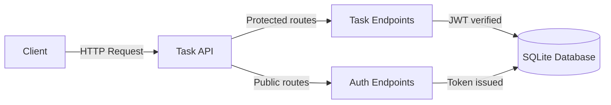

## Introduction

The Task API is a REST API for managing task lists. It uses JWT authentication to protect user data and is built with Node.js, Express, and SQLite. Its lightweight design makes it suitable for personal projects or small deployments.

**Tech stack:** Node.js • Express • SQLite • JWT authentication

## Getting started

If you're new to the Task API:

1. Install and run the API locally → [Setup Guide](setup.md)  
2. Make your first request → [Developer Quickstart](quickstart.md)

## Documentation

- [Setup Guide](setup.md) — install and configure the API locally  
- [Developer Quickstart](quickstart.md) — create your first user and task  
- [API Reference](api-reference.md) — full list of endpoints and request formats

## Base URL

Local development

`http://localhost:3000`

Production example

`https://api.example.com`

## What you can do with this API

- Register a new user  
- Log in and receive an authentication token  
- Create tasks  
- Retrieve and manage task lists

## Task API Workflow

## Who this documentation is for

This documentation is for developers using the Task API as a backend for to-do applications. It covers authentication and CRUD endpoints to help build a frontend without starting the backend from scratch. It also serves as a guide for those wanting to learn about authenticated REST APIs. Developers will see how JWT authentication, password hashing, and protected routes work together in a real Node.js application.

## What's in this documentation

The following sections help you get up and running with the Task API:

- [Setup](setup.md) — how to deploy the API on a server  
- [Getting Started](quickstart.md) — create an account and make your first request  
- [Authentication](authentication.md) — how JWT authentication works in this API  
- [API Reference](api-reference.md) — all endpoints with request and response examples  
- [System Architecture](architecture.md) — how the components fit together  
- [Troubleshooting](troubleshooting.md) — common errors and how to fix them

## Start here

If the Task API is not yet installed, see [Setup](setup.md) before continuing.
