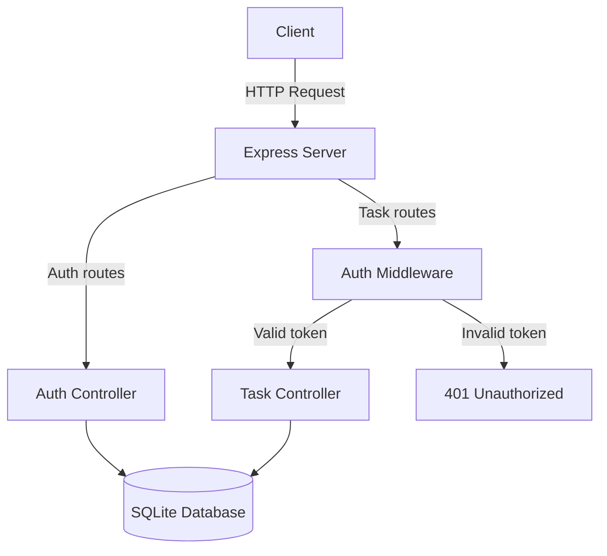
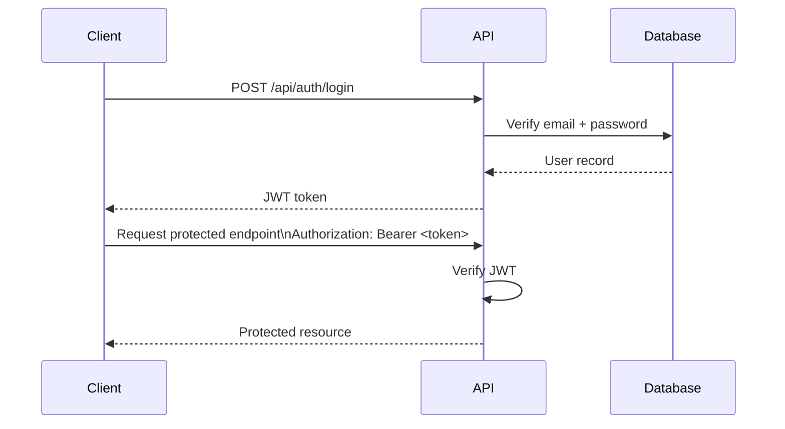

## Architecture Overview

The Task API is a stateless RESTful service built with Express. Authentication uses JSON Web Tokens (JWT). User credentials are stored securely using bcrypt. Task data is stored in a SQLite database. The application is organized into modules. Each module handles part of the request lifecycle.

The API follows a typical REST architecture: requests pass through routing and authentication middleware before reaching controllers that handle business logic and database access.

## What the API does

The Task API allows users to create and manage personal task lists. Each user has a separate account, and all task requests require a valid login token. The server checks this token before allowing access to any protected task endpoints.

## Technology stack

| Technology | Version | Purpose |
|------------|--------|---------|
| Node.js | v18 | Runtime environment |
| Express | v4 | Web framework |
| `better-sqlite3` | v9 | Database |
| `bcryptjs` | v2 | Password hashing |
| `jsonwebtoken` | v9 | JWT signing and verification |
| `uuid` | v9 | Unique ID generation |
| `dotenv` | v16 | Environment variable management |
| `nodemon` | v3 | Development server |

## Design considerations

- SQLite was chosen because it is lightweight and easy to set up for a small application. It does not require a separate database server.

- JWT authentication allows the server to verify users without storing session data. Because the server does not store session data, it can handle requests independently.

- Passwords are hashed with bcrypt before being saved, so the original password is never stored in the database.

- The code is organized into routes, controllers, and middleware so that each part of the system has a clear responsibility and can be tested independently.

## Folder structure

The project uses modular directories to separate routing, business logic, middleware, and database access. This structure keeps each part of the application focused on a single responsibility and makes the code easier to maintain and test.

```
developer-task-api/
├── src/
│   ├── server.js        
│   ├── db/
│   │   └── database.js  
│   ├── middleware/
│   │   ├── auth.js      
│   │   └── errorHandler.js
│   ├── controllers/
│   │   ├── authController.js
│   │   └── taskController.js
│   └── routes/
│       ├── auth.js      
│       └── tasks.js     
├── data/
│   └── tasks.db         
├── .env                 
├── .env.example         
└── package.json
```

## Users table

The `users` table stores account information required for authentication and identification. Each user record is created at signup and is referenced by the `tasks` table.

| Column      | Type | Required | Description |
|-------------|------|----------|-------------|
| `id`        | TEXT | Yes | UUID primary key. Generated automatically on signup |
| `email`     | TEXT | Yes | Must be unique across all users. Used as the login identifier |
| `password`  | TEXT | Yes | Stored as a bcrypt hash. The original password is never stored |
| `name`      | TEXT | Yes | Display name provided at signup |
| `created_at`| TEXT | Yes | ISO 8601 datetime. Set automatically when the record is created |

## Tasks table

| Column       | Type   | Required | Description |
|--------------|--------|----------|-------------|
| `id`         | TEXT   | Yes | UUID primary key. Generated automatically when the task is created |
| `user_id`    | TEXT   | Yes | UUID of the user who owns the task. References the `users.id` field |
| `title`      | TEXT   | Yes | Short title describing the task |
| `description`| TEXT   | No  | Optional longer description or notes for the task |
| `status`     | TEXT   | Yes | Task status. Accepted values: `pending`, `in_progress`, `completed` |
| `priority`   | TEXT   | Yes | Task priority level. Accepted values: `low`, `medium`, `high` |
| `due_date`   | TEXT   | No  | Optional due date in ISO 8601 format |
| `created_at` | TEXT   | Yes | Timestamp when the task was created |
| `updated_at` | TEXT   | Yes | Timestamp of the most recent update |


## High-Level Architecture

The following diagram shows how requests move through the API and how the server interacts with the database.



## Authentication flow

The following sequence shows how a user authenticates and accesses protected endpoints using a JSON Web Token (JWT).



## Request Lifecycle

1. A client sends an HTTP request to the Express server.

2. If the route is protected, the auth middleware verifies the JWT.

3. If valid, control passes to the appropriate controller.

4. The controller performs validation and interacts with the database.

5. A JSON response is returned to the client.